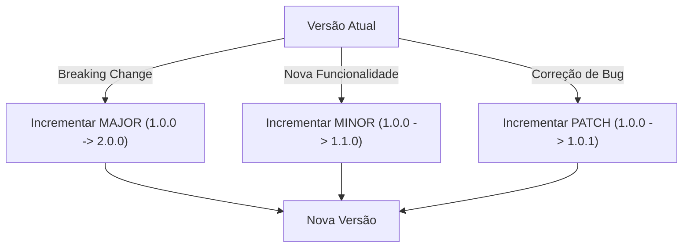

## Versionamento Semântico

O versionamento semântico segue o formato `MAJOR.MINOR.PATCH`:

- **MAJOR**: versão com mudanças incompatíveis na API
- **MINOR**: versão com adição de funcionalidades de forma compatível
- **PATCH**: versão com correções de bugs compatíveis com versões anteriores

Além disso, podem ser usados identificadores adicionais para pré-lançamentos (ex: `1.0.0-alpha.1`).

### Por que usar versionamento semântico?

O versionamento semântico oferece clareza sobre a natureza das mudanças e ajuda consumidores da API a entenderem o impacto potencial de uma atualização.

## Exemplos de Docker Build com Versionamento Semântico

Para construir uma imagem Docker usando versão semântica:

```bash
# Construindo imagem com versão completa
docker build -t algatransito-api:1.0.0 -f gradle-multistage.Dockerfile .

# Atualizando para uma versão com correção de bugs
docker build -t algatransito-api:1.0.1 -f gradle-multistage.Dockerfile .

# Atualizando para uma versão com nova funcionalidade
docker build -t algatransito-api:1.1.0 -f gradle-multistage.Dockerfile .

# Atualizando para uma versão com breaking change
docker build -t algatransito-api:2.0.0 -f gradle-multistage.Dockerfile .

# Usando a versão mais recente como "latest"
docker build -t algatransito-api:2.0.0 -t algatransito-api:latest -f gradle-multistage.Dockerfile .
```

Essas tags facilitam o gerenciamento de diferentes versões da mesma aplicação e permitem rollbacks eficientes quando necessário.
